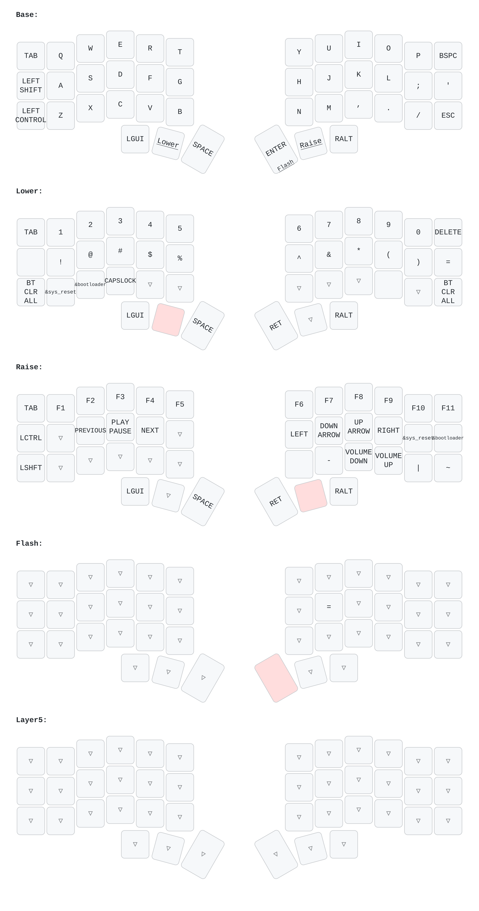

# 🌱 Corne ZMK Config with Dongle Support

This repository contains a ZMK configuration for the Corne keyboard—supporting both split halves and a central dongle setup.

---

## 🚦 Build Targets

| Target          | Device/Display            | Description                |
|-----------------|--------------------------|----------------------------|
| **corne_left**  | Nice Nano v2 + Nice View | Left half                  |
| **corne_right** | Nice Nano v2 + Nice View | Right half                 |
| **corne_dongle**| Nice Nano v2 + SSH1106   | Central dongle (USB HID)   |
| **settings_reset** | -                      | Clears paired devices      |

---

## 🖥️ Dongle Configuration

The central dongle (`corne_dongle`) acts as the hub for both halves.

- **Central role**: Keyboard halves connect wirelessly via Bluetooth
- **USB HID output**: Keyboard input via USB to PC
- **SSH1106 OLED display**: 128x64 px (1.3" compatible), I2C:
  - SDA → P0.17 (pin 17)
  - SCL → P0.20 (pin 20)
- **Advanced widgets**: Battery, layers, Bongo Cat, modifiers, HID indicators
- **Bluetooth**: Wireless connection for both halves
- **Identical keymap**: Same layout as halves

### Display Features

Powered by `zmk-dongle-display`:
- 🔋 Battery status (dongle + halves)
- 🔄 Layer indication
- ⌨️ Modifier keys (Shift, Ctrl, Alt…)
- 🐾 Bongo Cat typing animation
- 🔢 HID indicators (Caps/Num/Scroll Lock)

---

## 🔌 Hardware Requirements

### Dongle

- Nice Nano v2 controller
- SSH1106 OLED (128x64, 1.3”)
- Connections:
  - SDA → Pin 17 (P0.17)
  - SCL → Pin 20 (P0.20)
  - VCC → 3.3V
  - GND → GND

### Keyboard Halves

- Two Nice Nano v2 controllers
- Nice View displays + adapters
- Standard Corne handwired build

---

## 📝 Usage

1. **Build firmware** (GitHub Actions workflow)
2. **Flash dongle** with `corne_dongle` firmware
3. **Flash halves** with `corne_left` and `corne_right` firmware
4. **Connect dongle** to your computer via USB
5. **Power on halves**—they’ll auto-connect to dongle
6. **Enjoy typing!** Input transmits through dongle

---

## ⌨️ Keymap

- QWERTY base with homerow mods
- Lower: Numbers + symbols
- Raise: F-keys + media
- Extra: Special function layers
- **Identical keymap for all devices!**

### 🖼️ Keymap Drawer

Latest PNG here:


---

## 📥 Download Latest Firmware & Keymap

After each build, find the latest files here:

- 🟦 [Corne Left Firmware](firmware/corne_left%20nice_view_adapter%20nice_nano_v2-zmk.uf2)
- 🟩 [Corne Right Firmware](firmware/corne_right%20nice_view_adapter%20nice_nano_v2-zmk.uf2)
- 🟨 [Dongle Firmware](firmware/corne_dongle%20dongle_display-nice_nano_v2-zmk.uf2)
- 🧹 [Settings Reset Firmware](firmware/settings_reset-nice_nano_v2-zmk.uf2)
- 🖼️ [Keymap PNG](keymap/corne.keymap.png)

_Just click to download!_

---

## ⚙️ Configuration Files

| File/Folder                                  | Purpose/Contents                       |
|-----------------------------------------------|----------------------------------------|
| `build.yaml`                                 | Defines build targets (GitHub Actions) |
| `config/corne.conf`                          | Split halves config                    |
| `config/corne.keymap`                        | Keymap for split halves                |
| `config/corne_dongle.conf`                   | Dongle config                          |
| `config/corne_dongle.keymap`                 | Dongle keymap (identical to halves)    |
| `config/boards/shields/corne_dongle/`        | Dongle hardware shield definition      |

---

## 🛠️ Building & Artifacts

- Firmware builds automatically on push (GitHub Actions)
- Forks: workflow needs approval
- Download artifacts after each build:
  - `corne_left-nice_nano_v2-zmk.uf2`
  - `corne_right-nice_nano_v2-zmk.uf2`
  - `corne_dongle-nice_nano_v2-zmk.uf2`
  - `settings_reset-nice_nano_v2-zmk.uf2`

---

## 🖼️ Keymap PNG Generation

A workflow auto-generates PNG whenever `config/corne.keymap` changes—or trigger manually from Actions.

### Local Generation

1. **Install dependencies:**
   ```bash
   pip install keymap-drawer
   sudo apt-get install inkscape      # Ubuntu/Debian
   # OR: brew install inkscape        # macOS
   ```
2. **Create config for background color:**
   ```bash
   cat > keymap-config.yaml << EOF
   draw_config:
     svg_extra_style: |
       svg { background-color: #b8a78b; }
   EOF
   ```
3. **Generate PNG:**
   ```bash
   python -m keymap_drawer -c keymap-config.yaml parse -z config/corne.keymap | \
   python -m keymap_drawer -c keymap-config.yaml draw -z corne -o config/corne.keymap.svg -
   inkscape --export-type=png --export-dpi=300 config/corne.keymap.svg -o config/corne.keymap.png
   ```
---

## 🙌 Community & Related Projects

- **YADS Dongle Maker**: This repo ([janpfischer/zmk-dongle-screen](https://github.com/janpfischer/zmk-dongle-screen)) is "Yet Another Dongle Screen" (YADS) by @janpfischer—an advanced, modular ZMK dongle display project for the Seeeduino XIAO BLE and Nice!Nano v2.
- **ZMK Community**: Find support, discussion, and resources at the [ZMK Community](https://zmk.dev/community/).
- **@englmaxi/zmk-dongle-display**: The [zmk-dongle-display](https://github.com/englmaxi/zmk-dongle-display) project provides additional widgets and OLED support for ZMK dongle builds.
  
---

Enjoy your modern, functional, and beautiful split keyboard setup! 😊
